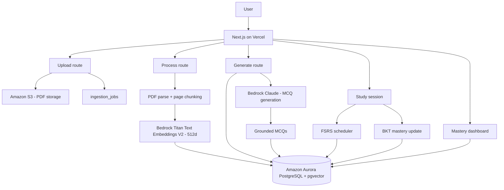

# Mastery

**Adaptive certification prep built on _your own_ materials.** Upload a lecture PDF, and Mastery
turns it into citation-grounded practice questions, schedules them with a real spaced-repetition
algorithm, and tracks your exam readiness per objective — all backed by a single Amazon Aurora
PostgreSQL database.

> **H0: Hack the Zero Stack with Vercel v0 and AWS Databases**
> **Track 1 — Monetizable B2C** · **AWS Database: Amazon Aurora PostgreSQL (with `pgvector`)** ·
> **Front end deployed on Vercel** · `#H0Hackathon`

---

## The problem

Generic certification prep does not match the materials you actually study from. Question banks are
detached from your lecture notes, give no citation you can trust, and review everything on a flat
schedule instead of focusing on what you are about to forget.

**Who it is for:** people studying for a certification — starting with **AWS Certified Cloud
Practitioner (CLF-C02)** — who already have lecture decks, slides, or notes and want practice that
is grounded in _those_ pages.

**Why this problem:** trustworthy, source-cited questions plus genuinely adaptive scheduling is the
combination that makes self-study efficient. Mastery proves the full loop end to end.

## What it does

1. **Pick a goal** — AWS CLF-C02.
2. **Upload one lecture PDF** — parsed into page-level chunks and embedded.
3. **Watch ingest + generation** — parse → chunk → embed → generate cited MCQs.
4. **Study** — multiple-choice questions, each showing `Source: filename p.X`.
5. **Adaptive scheduling** — every answer updates the card's next review date (sooner if you missed
   it, later if you knew it).
6. **Mastery dashboard** — per-objective readiness bars, coverage, due-today, and streak.

## AWS Database used

**Amazon Aurora PostgreSQL** is the single source of truth for the entire application. With the
**`pgvector`** extension it stores both relational data _and_ the vector embeddings used for
semantic retrieval — no separate vector store.

- Cert objectives, uploaded PDF metadata, page chunks **and their `vector(512)` embeddings**,
  generated questions, FSRS review state, every review event, and BKT mastery all live in one DB.
- `CREATE EXTENSION IF NOT EXISTS vector;` with an **HNSW index** on chunk embeddings for fast
  cosine similarity search.
- The Vercel serverless functions talk to Aurora over the **RDS Data API** (HTTPS + SigV4) — no
  long-lived connections to pool, which fits a serverless front end cleanly.

Example retrieval query (run before question generation to ground each MCQ in real pages):

```sql
SELECT c.content, c.page_number, d.filename
FROM chunks c
JOIN documents d ON d.id = c.document_id
ORDER BY c.embedding <=> $query_embedding   -- pgvector cosine distance
LIMIT 5;
```

## Architecture



**Data flow:** Upload PDF → extract page chunks → Titan embeddings → Aurora `pgvector` → retrieve
top-k chunks → Bedrock generation → grounded MCQs → study → FSRS scheduling + BKT mastery →
dashboard.

## Tech stack

| Layer | Choice |
| --- | --- |
| Front end / API | **Next.js (App Router)** deployed on **Vercel** |
| Database | **Amazon Aurora PostgreSQL** + **`pgvector`** (via RDS Data API) |
| Embeddings | **Amazon Bedrock — Titan Text Embeddings V2** (512 dimensions) |
| Generation | **Amazon Bedrock — Claude** (grounded, citation-only MCQs) |
| File storage | **Amazon S3** (uploaded PDFs) |
| Auth & billing | **Clerk** (sessions + Pro plan gating) |
| Scheduling | **FSRS** (`ts-fsrs`) spaced repetition |
| Mastery | **BKT** (Bayesian Knowledge Tracing) per objective |

### Core tables

`objectives` · `documents` · `chunks` (with `vector(512)`) · `items` · `review_state` ·
`review_log` · `mastery` · `ingestion_jobs` · `users` · `goals`

## Local development

### Prerequisites

- Node.js 20+
- An Aurora PostgreSQL cluster with the **RDS Data API** enabled and a Secrets Manager secret
- Amazon Bedrock model access (Titan Text Embeddings V2 + a Claude model)
- An S3 bucket and a Clerk application

### Environment

Create `.env`:

```bash
# Aurora via RDS Data API
RDS_RESOURCE_ARN=arn:aws:rds:...:cluster:...
RDS_SECRET_ARN=arn:aws:secretsmanager:...
RDS_DATABASE=mastery

# AWS credentials / region (used for Data API, Bedrock, S3 SigV4)
AWS_REGION=us-east-1
AWS_ACCESS_KEY_ID=...
AWS_SECRET_ACCESS_KEY=...

# Storage
AWS_S3_BUCKET=your-bucket

# Bedrock model IDs
BEDROCK_EMBEDDING_MODEL=amazon.titan-embed-text-v2:0
BEDROCK_GENERATION_MODEL=anthropic.claude-3-5-sonnet-...

# Clerk
NEXT_PUBLIC_CLERK_PUBLISHABLE_KEY=pk_...
CLERK_SECRET_KEY=sk_...

# Optional
CLERK_PRO_PLAN=pro            # Clerk Billing plan slug
FREE_MAX_GOALS=1              # free-tier limits
FREE_MAX_QUESTIONS_PER_DOC=5
MAX_QUESTIONS_PER_DOC=20      # generation cap (acts as the AI cost guard)
CRON_SECRET=...               # protects the cron ingestion route
DEMO_USER_EMAIL=demo@mastery.local
```

### Run

```bash
npm install
npm run migrate        # apply db/migrations/*.sql
npm run db:health      # verify Aurora + pgvector round-trip
npm run seed:demo      # optional: populate a judge-ready demo account
npm run dev            # http://localhost:3000
```

See [`docs/demo.md`](docs/demo.md) for the pinned demo PDF and the cold demo click-path, and
[`docs/`](docs/) for ingestion, generation, scheduling, and mastery notes.

## Business model

- **Free** — one cert goal, limited uploads, cited practice questions, adaptive review.
- **Pro (~$12–15/month)** — multiple goals, unlimited PDFs, full dashboard readiness, priority
  generation.
- **B2B roadmap** — cohort analytics and instructor dashboards for bootcamps and enterprise L&D.

## Submission

- **AWS Database:** Amazon Aurora PostgreSQL (with `pgvector`).
- **Track:** 1 — Monetizable B2C.
- **Demo video (< 3 min):** `<YouTube link>`
- **Live Vercel project:** `<https://…vercel.app>`
- **Vercel Team ID:** `<team_…>`
- **Architecture diagram:** see the Mermaid diagram above / `<diagram image link>`
- **AWS Database proof:** `<screenshot — AWS Console Aurora cluster + schema + a pgvector query>`
- **Bonus content:** `<blog/video link>` — published with `#H0Hackathon`

## Legal

AWS and AWS Certified Cloud Practitioner are trademarks of Amazon.com, Inc. or its affiliates.
Mastery is **not** affiliated with, endorsed by, or sponsored by Amazon Web Services. Mastery uses
only public CLF-C02 objective text and generates **original** practice questions grounded in your
uploaded materials — it does not reproduce real exam questions and does not guarantee certification
outcomes.
