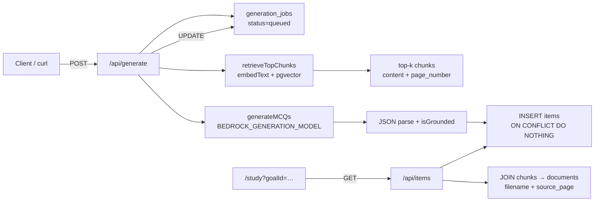

# Grounded MCQ generation (Phase 3)

Phase 3 turns embedded `chunks` (from Phase 2 ingestion) into page-cited multiple-choice questions stored in `items`. For a goal and optional objective or topic, the pipeline retrieves the most relevant chunks by pgvector cosine similarity, prompts a Bedrock generation model with **only** those chunks, validates grounding, and persists original MCQs with idempotent deduplication.

All database access uses `executeDataStatement` from `db/data-api.ts` (Aurora Data API). There is no direct `pg` connection or `DATABASE_URL`.

## End-to-end flow

### Step-by-step

1. **Generate** (`POST /api/generate`) — Body: `{ goalId, objectiveId? | topic?, count? }`. Inserts a `generation_jobs` row (`queued`), then runs retrieval → generation → item inserts. Returns `{ jobId, requested, generated, … }` on success; sets job `status='error'` on failure.
2. **Retrieval** (`lib/retrieval.ts`) — Embeds the query (explicit `topic`, or objective title/description from DB) with `embedText`, then runs a pgvector cosine nearest-neighbour search scoped to the goal's documents: `ORDER BY c.embedding <=> $queryVector LIMIT k`.
3. **Generation** (`lib/generate.ts`) — Builds a grounded prompt from retrieved chunks, invokes `BEDROCK_GENERATION_MODEL` on `bedrock-runtime.<AWS_REGION>.amazonaws.com` (SigV4-signed), parses JSON, and drops malformed or ungrounded items.
4. **Persist** — Each validated MCQ is inserted into `items` with `content_hash` derived from stem + options. `ON CONFLICT (goal_id, content_hash) DO NOTHING` prevents duplicates on re-run.
5. **Study UI** (`/study`) — Loads items via `GET /api/items?goalId=…`, renders stem + four options, reveals answer and explanation on submit, and shows **`Source: {filename} p.{source_page}`** prominently.

## pgvector top-k retrieval

`retrieveTopChunks({ goalId, objectiveId?, query?, k })`:

| Step | Detail |
|------|--------|
| Query text | `query` param, or objective `title` + `description` from `objectives` |
| Embedding | `embedText` (Phase 2 Titan V2 @512) |
| Search | `JOIN chunks c → documents d WHERE d.goal_id = … AND c.embedding IS NOT NULL` |
| Ranking | Cosine distance: `ORDER BY c.embedding <=> '$vec'::vector` |
| Limit | Top-`k` rows (generate route uses ~`min(20, max(count*2, 10))`) |

Returns chunk `id`, `content`, and `page_number` for prompt construction and citation validation.

## Grounding and citation prompt rules

The generation prompt in `lib/generate.ts` enforces:

1. **Chunks only** — Use ONLY the provided source chunks; no outside knowledge.
2. **Original questions** — Never copy or paraphrase real certification exam items.
3. **Exact source page** — Each question must cite the EXACT page number from its supporting chunk header (`page=` in the chunk block).
4. **Chunk binding** — `sourceChunkId` must match the chunk that fully supports the answer.
5. **Skip weak support** — If a chunk lacks enough material for a fair MCQ, emit no question for that chunk.

After the model responds, the parser:

- Requires valid JSON with `stem`, four `options`, `answerKey` (A–D), `explanation`, `sourcePage`, and `sourceChunkId`.
- Runs **`isGrounded`**: drops items where `sourcePage` does not match the retrieved chunk's `page_number`, or where `sourceChunkId` is unknown.

Only grounded items reach the database.

## Idempotency (`content_hash`)

Migration `0003_generation.sql` adds:

- `items.content_hash TEXT`
- Unique index `uq_items_goal_hash ON items (goal_id, content_hash)`

The generate route computes `content_hash = SHA-256(stem + "\n" + options.join("\n"))`. Re-running generation for the same goal with the same question text does not create duplicate rows — conflicting inserts are silently skipped via `ON CONFLICT (goal_id, content_hash) DO NOTHING`.

## Budget cap (`MAX_QUESTIONS_PER_DOC`)

`MAX_QUESTIONS_PER_DOC` limits how many questions a single generate request may ask for (default **20** when unset or invalid). The route clamps `count` to `min(requested, maxQuestionsPerDoc())` before calling the model.

This caps Bedrock cost and item volume per document/goal per run.

## API routes

| Route | Method | Purpose |
|-------|--------|---------|
| `/api/generate` | POST | Retrieve → generate → insert MCQs; track `generation_jobs` |
| `/api/items` | GET | `?goalId=` — list MCQs with `filename`, `source_page`, stem, options, answer key, explanation |

## Environment variables

See `.env.example`. Phase 3 generation requires (in addition to Phase 1/2 vars):

- `BEDROCK_GENERATION_MODEL` — Bedrock model ID for MCQ generation (e.g. Claude on Bedrock)
- `MAX_QUESTIONS_PER_DOC` — Per-request question ceiling (default 20)
- `AWS_REGION`, `AWS_ACCESS_KEY_ID`, `AWS_SECRET_ACCESS_KEY` — SigV4 for Bedrock invoke
- `BEDROCK_EMBEDDING_MODEL` — Used by retrieval via `embedText`
- Aurora Data API vars (`RDS_RESOURCE_ARN`, `RDS_SECRET_ARN`, `RDS_DATABASE`)

## Database (migration 0003)

Additive, idempotent migration `db/migrations/0003_generation.sql`:

- `items.content_hash` + unique `(goal_id, content_hash)`
- `idx_items_goal`, `idx_items_objective`
- `generation_jobs` table (mirrors `ingestion_jobs` pattern: `status`, `step`, `requested`, `generated`, `error`)

Do not edit `0001` or `0002`; apply `0003` statements one at a time via the Data API.

## UI

`/study` — Client component. Enter or pass `?goalId=` in the URL, load items from `/api/items`, answer MCQs, and review explanations with the source citation banner (`Source: {filename} p.{n}`). Answer rating and FSRS scheduling are Phase 4 — this page does not write `review_state` or `review_log`.
