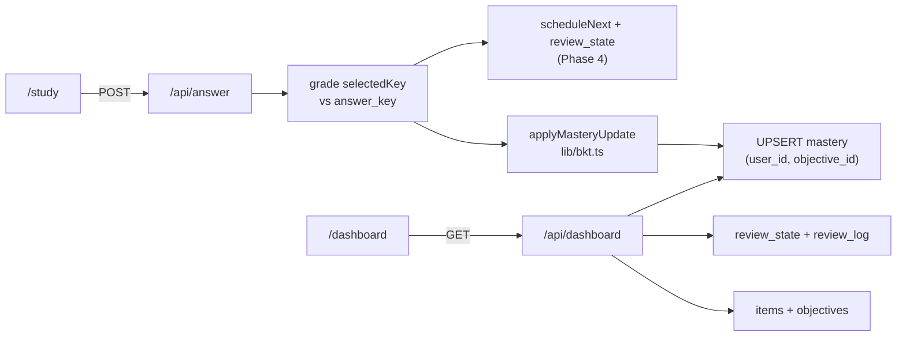

# BKT mastery (Phase 5)

Phase 5 tracks per-objective knowledge with Bayesian Knowledge Tracing (BKT) and surfaces it on a focused mastery dashboard. When a learner submits an MCQ in `/study`, the answer route grades the response, updates FSRS scheduling (Phase 4), and best-effort updates `mastery` for the item's objective via `applyMasteryUpdate`. The dashboard reads real database state — no hardcoded metrics.

All database access uses `executeDataStatement` from `db/data-api.ts` (Aurora Data API). There is no direct `pg` connection or `DATABASE_URL`. The `mastery` and `objectives` tables are defined in `0001_init.sql`; Phase 5 only adds indexes in `0005_mastery.sql`.

## End-to-end flow



### Step-by-step

1. **Study UI** (`app/study/page.tsx`) — On submit, POSTs to `/api/answer` with `userId`, `itemId`, `selectedKey`, and optional `responseMs` / `rating` (unchanged Phase 4 contract).
2. **Grade** (`app/api/answer/route.ts`) — Compares `selectedKey` to the item's `answer_key` and loads `objective_id` from the item row.
3. **Schedule** (Phase 4) — UPSERT `review_state`, INSERT `review_log`, return `{ previousDue, nextDue, rating, correct }`.
4. **Mastery** (`lib/bkt.ts` `applyMasteryUpdate`) — If `objective_id` is present, SELECT prior `p_known` (default 0.3), run `bktUpdate`, UPSERT `mastery` on `(user_id, objective_id)`. Wrapped in try/catch so a mastery failure never breaks the scheduling response.
5. **Dashboard UI** (`app/dashboard/page.tsx`) — Client component with `userId` + `goalId` inputs; fetches `GET /api/dashboard` and renders four metric cards plus per-objective mastery bars.

## BKT constants

Fixed in `lib/bkt.ts` (not configurable in Phase 5):

| Symbol | Constant | Value | Meaning |
|--------|----------|-------|---------|
| Prior | `BKT_PRIOR` | **0.3** | Default P(know) when no `mastery` row exists |
| Learn | `LEARN` | **0.15** | Probability of transitioning to “known” after each observation |
| Guess | `GUESS` | **0.25** | P(correct \| not known) |
| Slip | `SLIP` | **0.1** | P(wrong \| known) |

## Two-step update (`bktUpdate`)

Each graded attempt applies evidence, then a learn transition. Results are clamped to the open interval (0, 1) via a small epsilon.

### Step 1 — Evidence posterior

Given prior P(know) = `prior` and observation `correct`:

**Correct answer**

```
post = prior × (1 − slip) / [prior × (1 − slip) + (1 − prior) × guess]
```

**Wrong answer**

```
post = prior × slip / [prior × slip + (1 − prior) × (1 − guess)]
```

With the fixed constants: slip = 0.1, guess = 0.25.

### Step 2 — Learn transition

```
p_known = post + (1 − post) × learn
```

`learn` = 0.15. The returned value is clamped to (0, 1).

## `mastery` table

| Column | Role |
|--------|------|
| `user_id`, `objective_id` | Unique pair (`UNIQUE` in `0001_init.sql`) |
| `p_known` | Current BKT estimate after the latest update |
| `attempts` | Total graded attempts for this objective |
| `correct` | Count of correct attempts |
| `updated_at` | Timestamp of last upsert |

`applyMasteryUpdate(userId, objectiveId, correct)`:

1. `SELECT p_known` for the pair; if missing, use `BKT_PRIOR` (0.3).
2. `p_known = bktUpdate(prior, correct)`.
3. `INSERT ... ON CONFLICT (user_id, objective_id) DO UPDATE` — set `p_known`, increment `attempts`, add 1 to `correct` when `correct` is true, set `updated_at = now()`.

Phase 5 indexes (`0005_mastery.sql`): `idx_mastery_user` for per-user mastery lookups; `idx_items_goal_objective` for coverage checks joining items to objectives within a goal.

## Item ↔ objective linkage (coverage)

An objective is **covered** for a goal when at least one practice item exists for that pair:

```sql
EXISTS (
  SELECT 1 FROM items i
  WHERE i.goal_id = :goalId AND i.objective_id = o.id
)
```

Coverage is about content availability (items generated/ingested for the goal), not whether the learner has attempted questions. Objectives with no items show as “No items” on the dashboard; those with items show “Covered”.

## Dashboard metrics

`GET /api/dashboard?userId=&goalId=` loads all objectives for the goal's certification, left-joins `mastery` for the user, and computes four aggregate metrics from real SQL — never hardcoded.

| Metric | JSON field | Computation |
|--------|------------|-------------|
| **Readiness** | `overallReadiness` | Weighted mean of per-objective `p_known` when every objective has `weight_pct > 0` (weights from `objectives.weight_pct`); otherwise simple arithmetic mean. Objectives without a `mastery` row use `BKT_PRIOR` (0.3). |
| **Due today** | `dueToday` | `COUNT(*)` from `review_state` where `user_id` matches and `due IS NOT NULL` and `due <= now()`. |
| **Questions completed** | `questionsCompleted` | `COUNT(*)` from `review_log` where `user_id` matches (all past review events). |
| **Coverage** | `coverage` | `objectives with ≥1 item / total objectives` for the goal — i.e. `COUNT(covered) / COUNT(*)` where `covered` is the `EXISTS` check above. |

The response also includes `objectives[]`: `{ id, title, pKnown, covered }` for per-objective mastery bars and coverage badges on `/dashboard`.

## API reference

**`GET /api/dashboard`**

Query: `userId`, `goalId` — both UUIDs (required).

Response:

```json
{
  "overallReadiness": 0.42,
  "dueToday": 3,
  "questionsCompleted": 17,
  "coverage": 0.85,
  "objectives": [
    { "id": "…", "title": "…", "pKnown": 0.55, "covered": true }
  ]
}
```

**`POST /api/answer`** (Phase 4 contract unchanged)

Mastery is updated best-effort after scheduling. Response remains `{ previousDue, nextDue, rating, correct }` — mastery is not returned in the answer payload.
