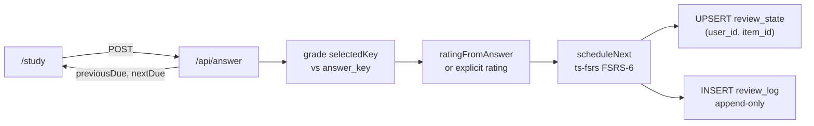

# FSRS scheduling (Phase 4)

Phase 4 turns study answers into adaptive review intervals. When a learner submits an MCQ in `/study`, the answer is graded, mapped to an FSRS rating, scheduled with `ts-fsrs` (FSRS-6 defaults), persisted as the current card in `review_state` plus an immutable row in `review_log`, and the UI shows the previous due date vs the new due date.

All database access uses `executeDataStatement` from `db/data-api.ts` (Aurora Data API). There is no direct `pg` connection or `DATABASE_URL`. The `review_state` and `review_log` tables are defined in `0001_init.sql`; Phase 4 only adds indexes in `0004_scheduling.sql`.

## End-to-end flow



### Step-by-step

1. **Study UI** (`app/study/page.tsx`) — Loads items from Phase 3 (`GET /api/items`), keeps the `Source: {filename} p.{page}` citation, and on submit POSTs to `/api/answer` with `userId`, `itemId`, `selectedKey`, and `responseMs` (or an explicit `rating`).
2. **Grade** (`app/api/answer/route.ts`) — Compares `selectedKey` to the item's `answer_key` to determine correctness.
3. **Rate** (`lib/fsrs.ts` `ratingFromAnswer`) — Maps correctness and response time to an FSRS `Rating` (see below). Callers may also send an explicit `rating` (1–4) from Again/Hard/Good/Easy buttons.
4. **Schedule** (`lib/fsrs.ts` `scheduleNext`) — Hydrates the prior card from `review_state` (or starts a fresh card), runs `scheduler.next` from `ts-fsrs`, and returns the next `{ stability, difficulty, due, state, reps, lapses, last_review }`.
5. **Persist** — UPSERT `review_state` on `(user_id, item_id)`; INSERT one `review_log` row per answer.
6. **Display** — The study page renders `Next review: {nextDue} (was {previousDue})` so judges can see adaptive scheduling in action.

## FSRS-6 via ts-fsrs

`lib/fsrs.ts` constructs the scheduler with FSRS-6 default weights:

```ts
const scheduler = fsrs(generatorParameters());
```

`generatorParameters()` supplies the FSRS-6 weight set (no custom weights in Phase 4). `scheduleNext(prev, rating, now)` either:

- Builds a fresh card with `createEmptyCard(now)` when there is no prior `review_state` row (or `state` is null), or
- Rehydrates the persisted fields (`stability`, `difficulty`, `due`, `state`, `reps`, `lapses`, `last_review`) into a `ts-fsrs` `Card`, then calls `scheduler.next(card, now, rating)`.

The returned `due` timestamp is what gets written back to `review_state` and returned to the client as `nextDue`.

## Rating mapping

`ratingFromAnswer(correct, responseMs?)` implements the automatic mapping used when the client does not send an explicit `rating`:

| Condition | FSRS `Rating` | Value |
|-----------|---------------|-------|
| Wrong answer | **Again** | 1 |
| Correct, response ≥ 10s | **Hard** | 2 |
| Correct (default) | **Good** | 3 |
| Correct, response ≤ 3s | **Easy** | 4 |

Thresholds: fast ≤ 3 000 ms, slow ≥ 10 000 ms. A correct answer in between maps to **Good**.

The UI may instead send an explicit `rating` (Again/Hard/Good/Easy = 1–4) to skip auto-mapping. `Rating` is re-exported from `lib/fsrs.ts` so clients and the API share the same enum.

## `review_state` vs `review_log`

| Table | Role | Write pattern |
|-------|------|---------------|
| **`review_state`** | Current FSRS card per `(user_id, item_id)` — stability, difficulty, due, state, reps, lapses, last_review | **Upsert** — `INSERT ... ON CONFLICT (user_id, item_id) DO UPDATE` replaces the single current row after each answer |
| **`review_log`** | Immutable history of every review event | **Append-only** — one `INSERT` per answer with `rating`, `response_ms`, post-schedule `state`/`stability`/`difficulty`, and `elapsed_days` since the previous review |

`review_state` answers “when is this item due next for this user?” `review_log` answers “what happened on each past review?” Phase 4 indexes (`0004_scheduling.sql`): `idx_review_state_user_due` for due-queue lookups, `idx_review_log_user_item` for per-item history.

## Proving adaptive scheduling (previous → new due)

The `/api/answer` response includes `{ previousDue, nextDue, rating, correct }`. The study page shows both dates so scheduling is visible without opening the database.

Because scheduling runs through real `ts-fsrs` FSRS-6 math (not hardcoded intervals):

- **Wrong (Again)** — The card is treated as failed; the next `due` is typically **sooner** than after a successful review (often minutes or the same day on early reps).
- **Correct + fast (Easy)** — High confidence; the next `due` is typically **later** than **Good** or **Hard** on the same card.
- **Correct + slow (Hard)** — Success with hesitation; interval grows less than **Good**/**Easy**.
- **Correct (Good)** — Standard successful review; moderate interval increase.

On a **first review** (`previousDue` is null / “never scheduled”), `nextDue` is set from a fresh card. On **subsequent reviews**, comparing `previousDue` to `nextDue` after a wrong vs easy answer on the same item demonstrates that intervals adapt to performance — wrong pulls the item back sooner; easy pushes it out later.

## API reference

**`POST /api/answer`**

Body: `{ userId, itemId, selectedKey?, responseMs?, rating? }`

- `userId`, `itemId` — UUIDs (required).
- `selectedKey` — `"A"`–`"D"`; required unless `rating` is provided.
- `responseMs` — optional; used for auto-rating when `rating` is omitted.
- `rating` — optional explicit 1–4 (Again/Hard/Good/Easy).

Response: `{ previousDue, nextDue, rating, correct }` — ISO timestamps for due dates (`previousDue` null on first review).
